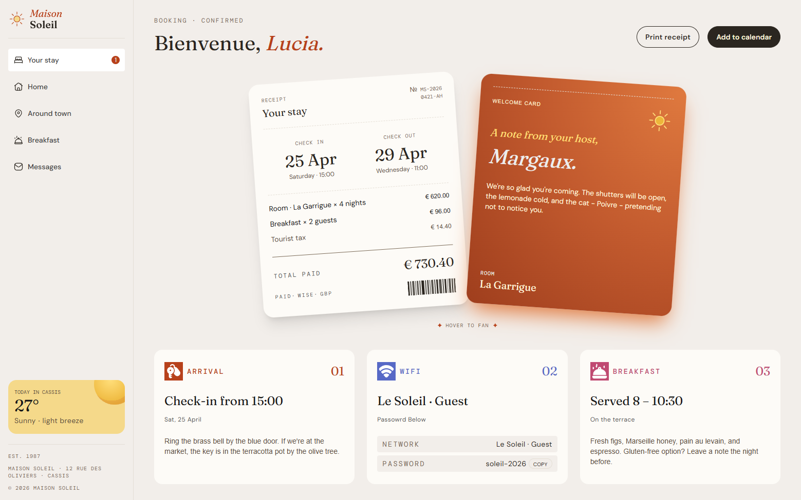

# ☀️ Maison Soleil – Guest Portal & Booking Confirmation
A beautifully crafted, modern booking confirmation and digital guest portal for Maison Soleil, a boutique stay located in the picturesque town of Cassis, France.

This project is a pixel-perfect recreation of a design concept (inspired by Frontend Mentor), built to deliver a seamless, responsive, and delightful user experience for arriving guests.

## 🎨 About the Project
Maison Soleil acts as a digital companion for guests prior to and during their stay. It replaces static confirmation emails with an interactive, beautifully styled web experience that outlines check-in instructions, host notes, Wi-Fi credentials, and booking receipts.
## 🛠️ Tech Stack
- Framework: Next.js (React)
- Styling: Tailwind CSS (for rapid, utility-first responsive styling)
- Animations: Framer Motion (for smooth page transitions and interactive hover effects)
- Icons: Custom SVGs